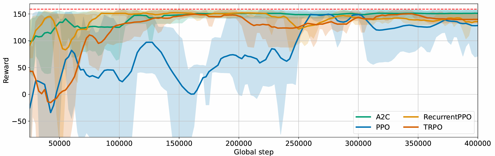
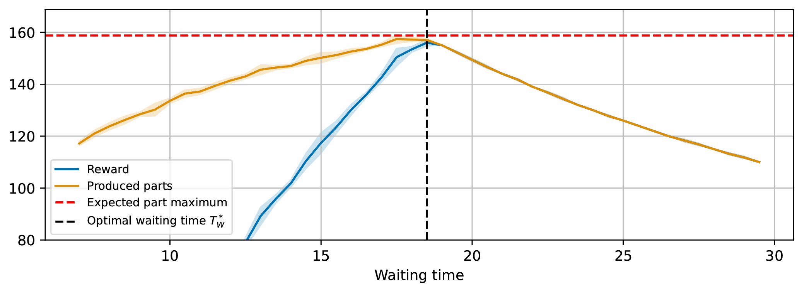

# Waiting Time

<video src="https://tobias-windisch.de/data/vids/lineflow_waitingtime.mov"
       autoplay
       playsinline
       loop
       muted
       style="max-width:100%">
  Sorry, your browser can’t play this video.
</video>

In this scenario, the goal is to determine the optimal waiting time between 
parts produced by a source station, shown in the image as S_main​. This station, 
along with another source S_component, supplies an assembly station, displayed 
as Assembly, which combines components from both sources to produce the final 
product. Once assembled, the product moves to the Sink.

A key challenge is that components from the component source have a limited 
lifespan, known as the assembly condition. If too much time passes between the 
moment a component is prepared at the source and when the assembly process 
begins at the assembly, the component becomes unusable. In such cases, the 
assembly must discard the expired component and wait for a replacement. This 
not only increases costs but also disrupts the workflow, as defective 
components must be removed before the assembly can continue. This issue is 
common in processes like adhesive bonding, where adhesives can dry out if 
not applied within a specific timeframe.

If the waiting time between parts is too short, the source produces excess 
components that the assembly cannot process in time, leading to unnecessary 
waste. Conversely, if the waiting time is too long, the assembly is left 
waiting for components, delaying production. The objective is to find a 
balance that ensures a steady supply of components at the assembly while 
minimizing waste and inefficiencies.

Since the assembly is assumed to be the bottleneck in the system, the overall 
production rate depends on how quickly this station can receive components, 
assemble them, and move the assembled product to the next buffer. The optimal 
waiting time should match the pace at which the assembly and the source process 
and handle parts to maintain a continuous and efficient workflow.

## What is optimized?
The processing times of the source station and the assembly station follow 
specific distributions. Similarly, the time required to move a component into 
and out of a buffer (put and get time) also follows distinct distributions. The 
goal is to determine the optimal waiting time at the component source, which must 
account for the difference between the time required by the assembly to complete 
processing and the time required by source to prepare its components. Essentially, 
the waiting time must bridge this gap to ensure a smooth workflow. By optimizing 
the waiting time of the component source, the earned reward (i.e. produced parts) 
can be maximized.

## Optimization using Lineflow
We used Lineflow to optimize the production line described above. To achieve this, 
we implemented A2C, PPO, Recurrent PPO, and TRPO algorithms. The maximum reward 
achieved was slightly below 160, with all algorithms successfully optimizing the waiting 
time and improving the reward. An explanation for the maximum reward this line can produce
is given in the following paragraph.



## Verification of the optimization
In this scenario, learning a fixed waiting time is sufficient to optimize production 
efficiency. The image shown below illustrates how different waiting times at the 
component source impact overall system performance, i.e. the reward.
Using the parameters mentioned above, the optimum waiting time for the line is 18.5. 
If this waiting time is chosen, the line can obtain a reward averaging nearly 160. 
Therefore, all algorithms used can optimize the line sufficiently.
For a detailed calculation and proof of the optimal waiting time, see *(Link to Lineflow paper)*.



## Code
```python
--8<-- "lineflow/examples/waiting_time.py"
```
