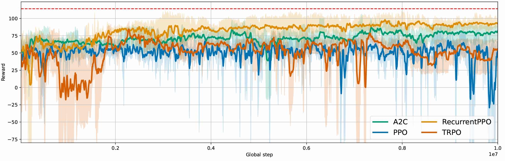
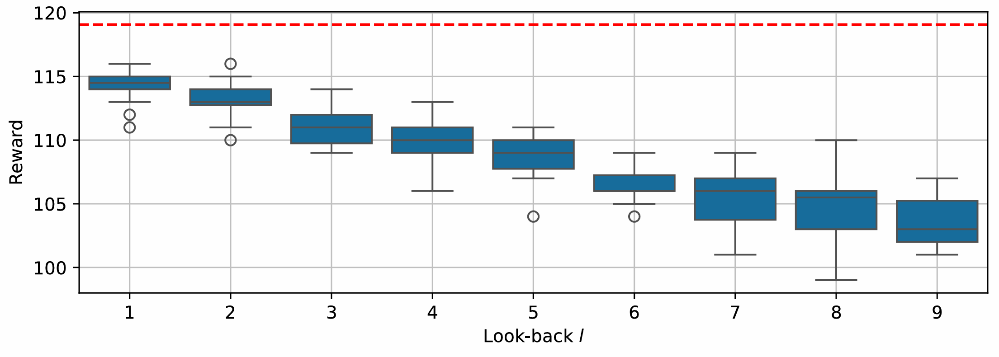

# Waiting Time Jump

<video src="https://tobias-windisch.de/data/vids/lineflow_waitingtime.mov"
       autoplay
       playsinline
       loop
       muted
       style="max-width:100%">
  Sorry, your browser can’t play this video.
</video>

To further explore dynamic adjustments in waiting times, we introduce a variation 
called Waiting Time Jump. In this scenario, the processing time at the assembly 
changes unexpectedly at a randomly selected moment within the simulation. During 
a predefined time window, the processing time at the assembly increases, affecting 
the overall assembly process. A visualization of these processing time variations 
across multiple simulations is provided in the figure below.


Since the exact timing and duration of these jumps *T<sub>jump</sub>* vary, the 
maximum possible output fluctuates as well. 
To ensure fair comparisons between agents, we construct the 
new assembly time based on *T<sub>jump</sub>*,​ so that the maximum possible reward 
remains constant. Specifically, we define a constant value *R* between 0.5 and 1.0 
and set a factor *f* so that the expected maximum number of produced parts is *R⋅N*, 
where *N* is the expected number of parts produced in the standard waiting time 
scenario without jumps. 
For a detailed explanation and proof, see *(Link to Lineflow paper)*.

## What is optimized?
A well-designed control strategy must adapt to these changes in real time. 
When the processing time changes, the agent only becomes aware of 
it after the first part is completed under the new conditions. When the processing 
time at the assembly suddenly increases, the system may initially 
continue operating with an outdated waiting time, resulting in expired components. 
Similarly, when the processing time decreases, the waiting time may be too long, 
causing unnecessary delays. The challenge for an adaptive control agent is to detect 
these changes as early as possible and adjust the waiting time accordingly.
If these changes to the assembly time are taken into account as quickly as possible, 
the waiting time can be optimized so that the reward is maximized.

## Optimization using Lineflow
Our line can achieve a maximum reward of 115, with the RecurrentPPO algorithm 
performing best. This method achieves an average reward of up to 106. The A2C 
algorithm achieves an average reward of over 100, although the other methods do not 
reach these results.


## Verification of the optimization
To assess the effectiveness of different control strategies, we evaluate how well 
an agent can learn and adapt to these shifts based on observed processing times. 
By continuously updating its estimates of how long assembly takes, the agent can 
optimize waiting times to maintain a stable and efficient production flow.

To develop an optimal strategy for WTJ, we estimate the processing time based on 
past observations. Specifically, we track the processing times reported from 
the assembly station and compute a rolling average over recent observations. 
A longer tracking period provides a more stable estimate but slows the agent’s 
ability to detect sudden jumps.

By testing different tracking periods, we found that using only the most recent 
observation allows the agent to respond the fastest, leading to the highest reward, as
shown in the figure below.
This optimized performance is used as the maximum possible reward (115) for our line.



## Code
```python
--8<-- "lineflow/examples/waiting_time.py"
```
