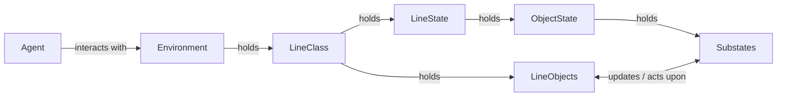

# Optimization using LineLlow
Reinforcement Learning (RL) provides a powerful paradigm for learning control policies through
trial-and-error interactions with a simulated environment. In the context of LineFlow, RL agents
observe the current state of a production line, select control actions and receive feedback in the
form of performance‐based rewards. Over many episodes, agents learn to optimize throughput, minimize
scrap, and adapt to stochastic disturbances without hand-crafting rule‐based strategies. 

This chapter explains how observation and action spaces are defined and how to train RL agents on
custom production line setups. Note that once a production line is implemented in LineFlow, it can
easily wrapped into a [`gymnasium`](https://gymnasium.farama.org) environment.
Please also have a look into [`train.py`][scripts.train] how models may be trained and validated using 
[`stable_baselines3`](https://stable-baselines3.readthedocs.io/en/master/).

## Observation Space
In RL, the observation space defines what the piece of information the agent sees at each interaction
step. It is therefore a subset of the
[`LineState`][lineflow.simulation.states.LineStates]. In LineFlow, all states
marked `is_observable=True` in your line’s `LineStates` are automatically aggregated
into a flat observation vector. Common observable features include:

- Buffer fill levels (normalized counts of carriers in each buffer)
Station modes (waiting, working, failing)
- Processing times of the last completed tasks
- Worker assignments (how many workers are currently at each station)

By default, LineFlow normalizes numeric values (e.g. fill levels to [0,1]),
encodes discrete categories as integers, and excludes unobservable or lagged
states. You can customize which states appear in the observation space by
toggling the is_observable flag when you construct each DiscreteState,
NumericState, etc.


## Action Space
The action space specifies what decisions the agent can enact at each step. In LineFlow, any state
flagged `is_actionable=True` becomes part of the action vector. Typical actionable controls include:

- Setting waiting times at Source stations (numeric)
- Routing choices at Switch stations (selecting an outgoing buffer index)
- Worker assignments (which station each worker in a WorkerPool should serve)
- On/off or mode changes for switches or machines

LineFlow enforces bounds on each action (e.g. allowed
waiting-time ranges, valid buffer indices) and will raise an error if the agent
proposes out-of-range values.

## Environment

[`LineSimulation`][lineflow.simulation.environment.LineSimulation]
is a wrapper around a LineFlow simulation that makes it
compatible with Gymnasium's Env interface. It allows you to treat a LineFlow
production line as a Gym environment, providing action_space, observation_space,
and core methods step, reset, render, and close.

### Initialization

```python
from lineflow.simulation import LineSimulation

# wrap your custom line into a Gym environment
env = LineSimulation(
    line=MyNewLine(),                # your LineFlow scenario instance
    simulation_end=4000,             # simulation time horizon per episode
    reward='parts',                  # choose 'parts' or 'uptime'
    part_reward_lookback=0,          # window for uptime averaging if reward='uptime'
    render_mode=None,                # 'human' to enable interactive rendering
)
```


### `step()`
```python
observation, reward, terminated, truncated, self._get_info() = env.step(actions)
```
The step function is the core function of a LineSimulation, it performs one step
by:

- Applying the actions of the Agent
- Running one simulation step
- Reciving the the state that was possibly influenced by the applied actions
- Calculating the reward

The two implemented `reward` calculations are:

- Parts reward (`reward='parts'`): Net new parts produced minus scrap since the last step, with scrap penalized by `line.scrap_factor`.
- Uptime reward (`reward='uptime'`): Mean uptime over the last
  `part_reward_lookback` time units.


To implement a custom reward, modify the reward logic in this section or override the step method.

### `reset()`

```python
obs, info = env.reset(seed=None, options=None)
```
Resets the environment and simulation:

- Calls `line.reset(random_state=seed)` internally to reset randomness. This ensures the
environment behaves differently every time.
- Resets internal counters, like number of produced or scraped parts.
- Resets all line objects to initial state, i.e., removes all carriers from the production line.
- If `render_mode='human'`, sets up drawing and renders the first frame.

## Training

LineFlow follows the standard Gym API, so any Gym-compatible RL library will
work. For example, with the PPO implementation of `stable_baselines3`:

```python
import stable_baselines3 as sb

model = sb.PPO(
    "MlpPolicy",
    env,
    learning_rate=3e-4,
    batch_size=64,
    verbose=1
)
model.learn(total_timesteps=200_000)
```

Key hyperparameters to tune include learning rate, batch size, and the frequency of policy updates.
Because production-line dynamics can exhibit long time constants (ramp ups, buffer transient), it’s
often beneficial to train with a curriculum of increasing episode lengths or gradually more
challenging line layouts.


## Debugging

To visualize model actions, instanziate the environment with `render_mode='human'`:

```python
env_eval = LineSimulation(
    line=MyNewLine(),
    simulation_end=4000, 
    render_mode='human',
)
```

Then, the interaction of a trained `model` can be visualized as follows:

```python
obs, _  = env_eval.reset()
done = False
while not done:
    action = model.predict(obs, deterministic=True)
    obs, reward, terminated, truncated, info = env_eval.step(action)
    done = terminated or truncated
env_eval.close()
```

## [Evaluation](#evaluation)
An online evaluation can be done using materials on board of the training framework. Here is an
example how an online evaluation can take place if 
using `stable_baseline3`
`EvalCallback`. Here, a `curriculum_callback` is triggered which may increases the difficulty of the task (see below):

```python
eval_callback = EvalCallback(
    eval_env=env_eval,
    deterministic=True,
    n_eval_episodes=1,
    eval_freq=10, 
    callback_after_eval=curriculum_callback,
)
```
How often the model is evaluated can be controlled over the `eval_freq` argument, we refer to the
official documentation of
[stable_baselines3](https://stable-baselines3.readthedocs.io/en/master/) for details. Then, pass
the `EvalCallback` to the training via the callback argument.

```python
model.learn(
    total_timesteps=10_000,
    callback=eval_callback)
)
```

## Monitoring
LineFlow integrates [Weights & Biases](https://wandb.ai) over the
[`stable_baselines3`](https://stable-baselines3.readthedocs.io/en/master/) API for logging of
rewards, episode lengths, and custom metrics. You can log
additional information using the `info` parameter of a
[`Line`][lineflow.simulation.line.Line] object. The
`info` parameter must be a list of tuple passed as a string. The tuple pairs
consist of the line object name and the name of the state you want to track for
the given object, for instance:


```python
from lineflow.examples import MultiProcess

line = MultiProcess(
    alternate=False,
    n_processes=3,
    info=[('SwitchD', 'index_buffer_out')],
)
```

returns information about the outgoing buffer of `SwitchD` to the `info` dict returned by
`env.step`.

## Curriculum learning
Curriculum learning in reinforcement learning is a training strategy where an agent is exposed to a sequence of tasks
that gradually increase in complexity or difficulty. This approach helps the agent to learn simpler tasks first, 
building foundational skills that can be transferred to more challenging tasks, improving learning efficiency and performance.
It mimics the way humans learn progressively and is particularly useful in
environments with sparse rewards or complex dynamics.

In LineFlow we provide the
[`CurriculumLearningCallback`][lineflow.learning.curriculum.CurriculumLearningCallback].
Its `_on_step` method is called every step. The user can use this method to evaluate
whether some aspect of the training should be changed. The `update_task` method
calls env_methods that are defined in the
[`LineSimulation`][lineflow.simulation.environment.LineSimulation] environment.

Our curriculum learning callback updates the scrap factor when the reward reaches
a certain thresh hold over a given look back period.

```python
curriculum_callback = CurriculumLearningCallback(
    threshold=100, 
    update=0.2, 
    look_back=3,
)
```

The curriculum callback can be run in every evaluation via the `EvalCallback`
(see [Evaluation](#evaluation)).

## Agent Interaction
The following diagram visualizes the class interactions.


